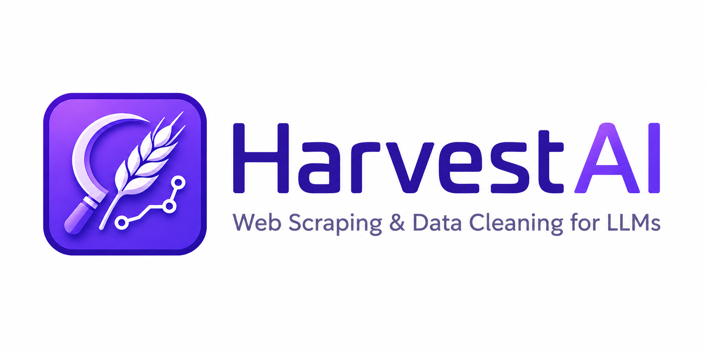

# HarvestAI — Web Scraping & Data Preparation for LLMs



A production-grade .NET package for scraping, crawling, and cleaning web content into LLM-ready chunks. Built on Playwright for full JavaScript rendering, with smart chunking, session management, and login support out of the box.

---

## Features

- **Full JS Rendering** — Playwright-powered scraping handles SPAs and dynamic content
- **Recursive Crawling** — Automatically discovers and follows internal links
- **HTML → Markdown** — Intelligent conversion that preserves structure and headings
- **Smart Chunking** — Token-aware segmentation optimized for LLM context windows
- **Concurrent Processing** — Configurable concurrency for high-throughput crawls
- **Login Support** — Non-headless mode lets users authenticate before scraping
- **Image Downloading** — Optionally download page images via the authenticated session
- **Content Cleaning** — Normalizes and sanitizes output for AI model consumption

---

## Requirements

- .NET 8.0 or later
- Windows, Linux, or macOS

---

## Installation

```bash
dotnet add package HarvestAI --prerelease
```

Or via the NuGet Package Manager console:

```powershell
Install-Package HarvestAI -Prerelease
```

### Playwright Browser Setup

After installing the package, Chromium binaries must be present on the machine. Choose either option below.

**Option 1 — HarvestAI companion tool (recommended):**

```bash
dotnet tool install --global HarvestAI.Setup
harvestai-setup
```

On Linux, pass `--with-deps` to also install Playwright system dependencies:

```bash
harvestai-setup --with-deps
```

**Option 2 — Install Playwright directly:**

```bash
dotnet tool install --global Microsoft.Playwright.CLI
playwright install chromium
```

On Linux, to also install system dependencies:

```bash
playwright install --with-deps chromium
```

---

## Quick Start

```csharp
using HarvestAI.WebScraping;

var service = new WebScrapingService(maxConcurrency: 2, outputDirectory: "harvest-output");
var browserSession = await service.LoadWebsite(needLogin: false);

try
{
    await browserSession.Page.GotoAsync("https://example.com");

    var userSession = new UserSession
    {
        UserId = "demo-user",
        NeedLogin = false,
        BrowserSession = browserSession
    };

    var (htmlContent, chunks) = await service.SinglePageScrapingAsync(userSession, metadata: true);

    Console.WriteLine($"Scraped {chunks.Count} chunks from {htmlContent.Length} bytes of HTML.");
}
finally
{
    await service.DisposeSessionAsync(browserSession);
}
```

---

## Usage

### Scrape a Single Page

```csharp
var service = new WebScrapingService(maxConcurrency: 5, outputDirectory: "output");
var session = await service.LoadWebsite(needLogin: false);

try
{
    await session.Page.GotoAsync("https://example.com");

    var userSession = new UserSession
    {
        UserId = "user123",
        NeedLogin = false,
        BrowserSession = session
    };

    var (htmlContent, chunks) = await service.SinglePageScrapingAsync(userSession, metadata: true);

    Console.WriteLine($"Chunks: {chunks.Count}");
}
finally
{
    await service.DisposeSessionAsync(session);
}
```

### Scrape a Single Page with Images

Pass `withImages: true` to download page images via the authenticated browser session. Downloaded images are saved to `outputDirectory/images/` and their paths are embedded in the returned markdown.

```csharp
var (htmlContent, chunks) = await service.SinglePageScrapingAsync(
    userSession,
    metadata: true,
    withImages: true
);
```

### Scrape a Login-Required Website

```csharp
var service = new WebScrapingService(maxConcurrency: 2, outputDirectory: "harvest-output");
var browserSession = await service.LoadWebsite(needLogin: true);
var url = "https://www.example.com/";

await browserSession.Page.GotoAsync(url);

bool loggedIn = await service.WaitForLoginAsync(browserSession, timeoutSeconds: 1200);

if (!loggedIn)
{
    Console.WriteLine("Login not completed. Aborting.");
    await service.DisposeSessionAsync(browserSession);
    return;
}

// Navigate back to target after login
await browserSession.Page.GotoAsync(url);

try
{
    var userSession = new UserSession
    {
        UserId = "demo-user",
        NeedLogin = true,
        BrowserSession = browserSession
    };

    var (htmlContent, chunks) = await service.SinglePageScrapingAsync(userSession, metadata: true);

    Console.WriteLine($"Scraped {chunks.Count} chunks.");
}
finally
{
    await service.DisposeSessionAsync(browserSession);
}
```

### Scrape Selected Pages

```csharp
var urls = new List<string>
{
    "https://example.com/page1",
    "https://example.com/page2",
    "https://example.com/page3"
};

var results = await service.ScrapeSelectedPagesAsync(userSession, urls, metadata: true);
```

### Recursive Website Crawl

```csharp
var results = await service.ScrapeWebsiteAsync(userSession, login: false, metadata: true);
Console.WriteLine($"Crawled {results.Count} pages.");
```

### Scrape by Element Attribute

Targets only elements whose attributes contain the given value — useful for scraping specific components like article bodies or sidebars.

```csharp
var (html, chunks) = await service.ScrapeByValueAsync(
    userSession,
    attributeValue: "article-content",
    metadata: true
);
```

### Get Internal Links

```csharp
var links = await service.GetInternalLinksList(userSession);
links.ForEach(Console.WriteLine);
```

### Scrape a URL Without a Session

```csharp
await service.SinglePageScrapingAsync("https://example.com", metadata: true);
```

---

## Output Format

All scraping methods return content as structured `FileContent` objects containing typed `Chunk` lists.

```csharp
public class FileContent
{
    public List<Chunk> Sections { get; set; }                  // Content chunks
    public string MimeType { get; set; }                        // Always "text/markdown"
    public Dictionary<string, string> Metadata { get; set; }   // URL, UserId, etc.
}

public class Chunk
{
    public string Content { get; set; }                         // Markdown text
    public int ChunkNumber { get; set; }                        // Sequence number
    public Dictionary<string, object> Metadata { get; set; }   // Heading context, section, etc.
}
```

When `metadata: true` is passed, each chunk includes heading context fields (`chapter`, `title`, `section`, `subsection`, `subsubsection`, `topic`) derived from the page structure.

### Writing Chunks to Disk

```csharp
var (htmlContent, chunks) = await service.SinglePageScrapingAsync(userSession, metadata: true);

using var writer = new StreamWriter("output.md", false);
await writer.WriteLineAsync($"HTML length: {htmlContent.Length}");
await writer.WriteLineAsync($"Chunk count: {chunks.Count}");

foreach (var chunk in chunks)
{
    await writer.WriteLineAsync($"## Chunk {chunk.ChunkNumber}");
    foreach (var item in chunk.Metadata)
        await writer.WriteLineAsync($"- {item.Key}: {item.Value}");
    await writer.WriteLineAsync(chunk.Content);
}
```

### Output Directory Structure

When `outputDirectory` is set, intermediate files are organized by user:

```
outputDirectory/
├── userId1/
│   ├── page-slug-1.md
│   ├── page-slug-2.md
│   └── ...
├── userId2/
│   └── ...
└── images/
    ├── image_0.jpg
    ├── image_1.png
    └── ...
```

---

## Configuration

### Constructor

```csharp
new WebScrapingService(
    maxConcurrency: 5,      // Max concurrent page downloads (default: 5)
    outputDirectory: null,  // Directory for saved files (optional)
    loggerFactory: null,    // ILoggerFactory for diagnostics (optional)
    httpClient: null        // Custom HttpClient (optional)
);
```

### Chunk Size

The default chunk size is 512 tokens. Override it via the converter directly:

```csharp
converter.Convert(htmlContent, maxTokensPerChunk: 1024);
```

---

## Session Validation

Always validate a session before long-running operations:

```csharp
if (await service.IsSessionInvalid(session))
{
    Console.WriteLine("Session is no longer valid.");
    return;
}
```

---

## Error Handling

```csharp
try
{
    var results = await service.ScrapeWebsiteAsync(userSession, login: false);
}
catch (ArgumentNullException ex)
{
    Console.WriteLine($"Invalid session: {ex.Message}");
}
catch (Exception ex)
{
    Console.WriteLine($"Scraping failed: {ex.Message}");
}
```

---

## Performance Tips

- Increase `maxConcurrency` (up to ~20) for large sites, but monitor CPU and memory
- Reuse browser sessions when scraping multiple pages from the same domain
- Use `ScrapeSelectedPagesAsync` instead of a full crawl when target URLs are known
- Set `metadata: false` when heading context is not needed — slightly faster chunking

---

## Limitations

- **Rate limiting** — Aggressive concurrency may trigger blocks on some sites; tune `maxConcurrency` accordingly
- **Large sites** — Sites with 1000+ pages require significant memory and time
- **Network timeouts** — Default timeout is 90 seconds per page
- **Image downloads** — Session-bound CDN images (e.g. Instagram) require `withImages: true` and an authenticated session to download successfully

---

## Dependencies

| Package | Version | Purpose |
|---|---|---|
| Microsoft.Playwright | 1.45.0+ | Browser automation |
| HtmlAgilityPack | 1.11.61+ | HTML parsing |
| Microsoft.Extensions.Logging.Abstractions | 8.0.1+ | Logging interface |
| Tiktoken | 1.0.0+ | Token counting |


---

## License

MIT — see [LICENSE](LICENSE) for details.

## Contributing

Contributions and feedback are welcome. Please open an issue or pull request on the [GitHub repository](https://github.com/Abdelwaheb-bhs/HarvestAI-).


---

> **Pre-release notice:** This is a `0.1.9-pre` package. The public API may change based on early adopter feedback. Review the changelog before upgrading.
